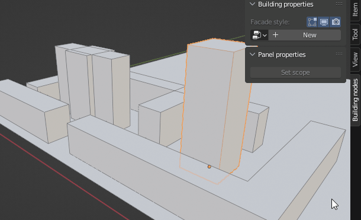
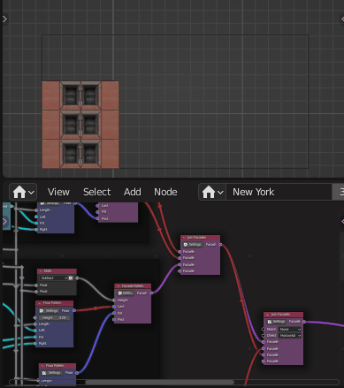
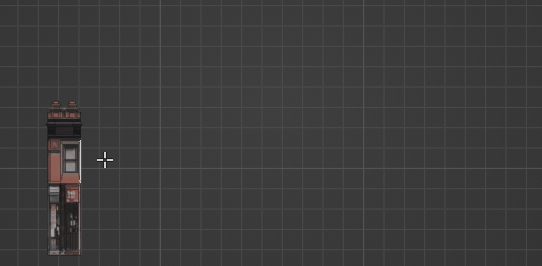

# 🏗️ BuildingNodes

🏠 Tool for fast procedural building modeling | [Blender 3.0+](https://www.blender.org/) add-on 🏠 

⏳ Work in progress ⏳

## [Documentation](https://durman.github.io/BuildingNodesDocs/)

## Description

This is a tool for procedural generation of buildings. The work of the add-on
is similar to panel housing construction. The process is composed of three
steps:

1. Creating Panel. This should be done with standard Blender tools.
2. Creating building style. There is dedicated for this node tree editor.
3. Creating base mesh which will be turned into a building. It also should be 
   created with standard Blender modeling tools.

After the steps, a building style can be applied to a base mesh. Instead of
base mesh the add-on will create a building. Base mesh and building style can
be edited any moment and changes will be applied at once.

## Features
|  |
|:---:|
| Once building style was created it can be applied to as many objects as you wish. |
| |
| Using nodes for creating building styles. |
| |
| Editing buildings in real time. |

**Advantages:**
- Ease of usage
- Achieve the same results with lesser nodes.
- The work of the add-on nodes is intuitively clearer. The abstraction of the
  nodes is close to real world objects.
- No need in learning vector math, different algorithm of mesh processing and
  data structure of a geometry.

## Limitations / Roadmap

- There are no any tools for roofs modeling. 
- Using Geometry nodes for generating base meshes is currently [unsupported][1].
- Using Loop cut tool with live update makes Blender to [crush][2]. Using edge
  crease tool also works weird.
- Custom properties per building and node groups [are not supported][3].
- [Base mesh][4] should consist only of quad polygons.
- Animation [is not supported][1].

[1]: https://durman.github.io/BuildingNodesDocs/execution_system.html
[2]: https://developer.blender.org/T67093
[3]: https://durman.github.io/BuildingNodesDocs/execution_system.html#tree-editor
[4]: https://durman.github.io/BuildingNodesDocs/data_structure.html#base-geometry

Some of this limitation should be gone in future versions.

https://user-images.githubusercontent.com/28003269/140365097-63408046-33dc-4fd8-8cbf-4f52fe9dc973.mp4
